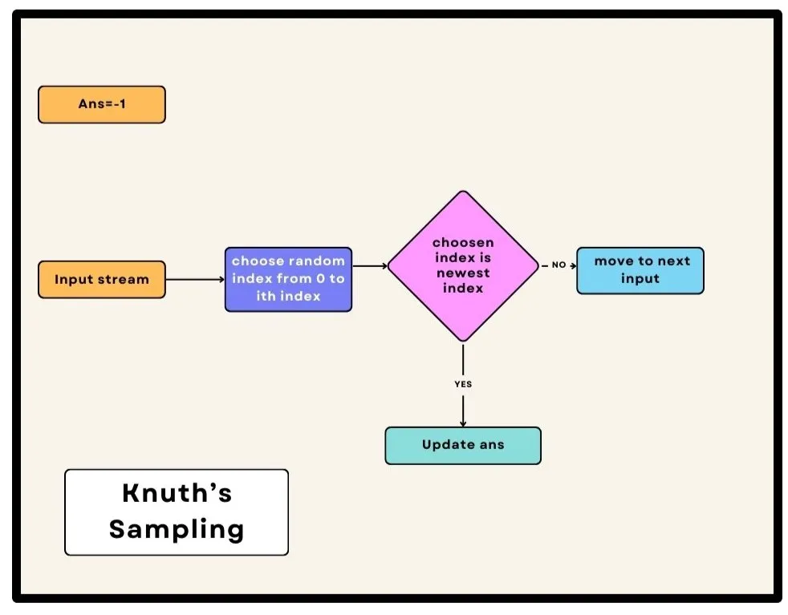

## Knuth's Method/Algorithm
Its also known as Reservoir sampling. 

The problem statement is to return a random input from a given input stream we need to have the probability for each number as 1/n where n is the total numbers/inputs present.

in this case, let's say, each input from 1 to n will have the probability of getting selected as 1/n where n is the total number of inputs so it is required that n is known but if we receive a stream of inputs or a linked list or a very big input file we might not have a fixed value of n right?

We can always store input in a list or array which can cost extra space, we can avoid this space by using the Reservoir sampling algorithm.

Knuth’s method, also known as the “reservoir sampling” algorithm, is a simple yet efficient technique for selecting a random sample from a stream of data without storing all the elements. The idea is to maintain a “reservoir” (in this case, a single variable) and update it as you encounter new elements.

The key insight behind Knuth’s method is to ensure that each element has an equal probability of being selected at any given time here selecting any one element from n numbers will have a probability of 1/n.
Here’s an expanded explanation of Knuth’s method to get a random input from an input stream.



### Initialization:

    1. Start with an “Ans” variable. This variable represents the currently selected input.
    
    2. Initialize a “Count” variable to 0. This counter variable keeps track of the number of words/inputs encountered so far.

### Reservoir Sampling

    1. The main idea is to process the words one by one while maintaining the output.
    
    2. For each new word encountered, you decide whether to select it as the answer or not.
    
    3. We can use the random function to generate a random index from inputs that have occurred till now if the newly generated index is “Count-1” we can update the answer.

### Pseudo Code
```
Ans=-1
Count=0

while(input stream){
  count++
  randomIndex = rand()%count
  if(randomIndex == Count-1){
    Ans = arr[randomIndex]
  }
}

return Ans
```

## Additional Resources
1. https://algs4.cs.princeton.edu/code/javadoc/edu/princeton/cs/algs4/Knuth.html
2. https://algs4.cs.princeton.edu/11model/Knuth.java.html
3. [Knuth's algorithm S](https://rosettacode.org/wiki/Knuth%27s_algorithm_S)